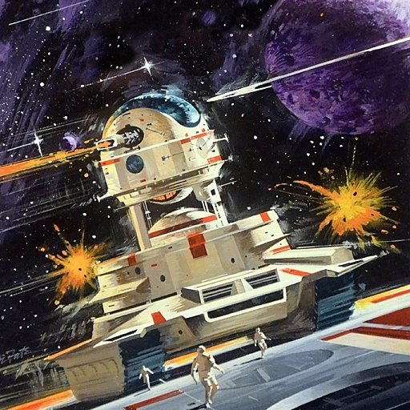
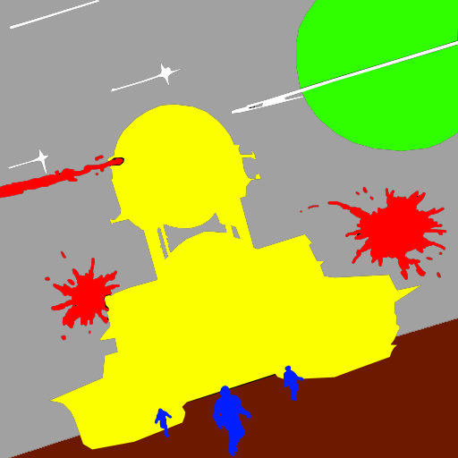

## Test 2

This test took a illustrated with space scence a semantic annotation map to generate image analogies `#NeuralDoodle`

The output results provide a better understanding of "what" the semantic map does does and how it is used.

### command

`doodle --style train-space.png --output doodle-space.png --device=cpu --iterations=40`

### style

### content

### output

