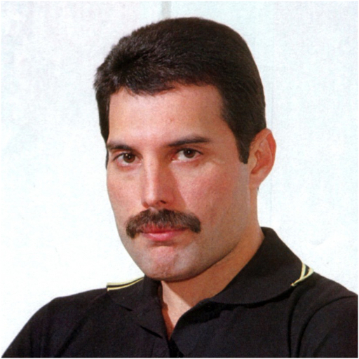
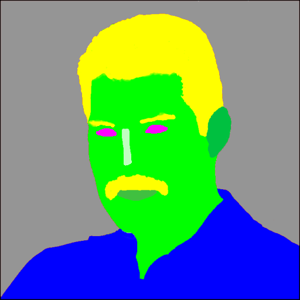
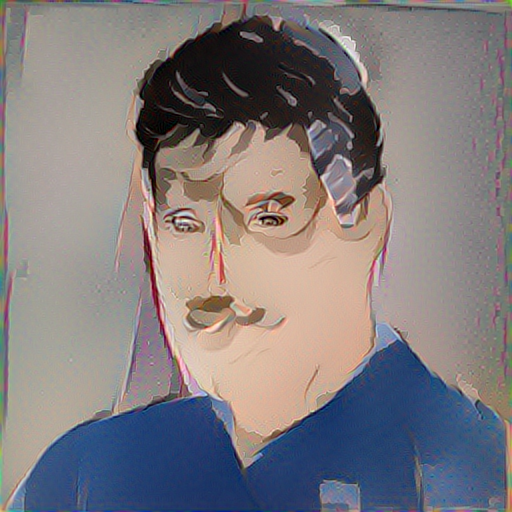

## Test 6

This test took a picture of a Freddie with semantic annotation map to perform regular style transfer that will synthesize a portrait of him like a Nagel.

The semantic annotation maps were made from images masks using Photoshop.

### command

```
doodle --style style-nagel.jpg --content content-freddie.png --output render-Freddie-Nagel.png --device=cpu --phases=4 --style-weight=50.0 --iterations=40
```
### style


### content





### output




