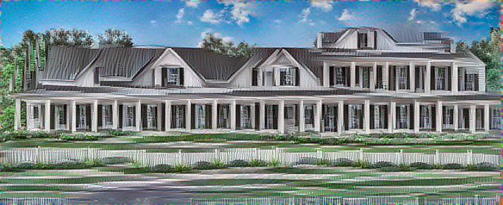

## Test 7.1

This test is an iteration of [Test 4](../test4/README.md) with a better crafted semantic annotation maps.

### command

```
doodle --style train-more-house.png --output content-sketch-house-more.png --device=cpu --iterations=40 --semantic-weight=1.0
```

### style


### source


### content    



### output


