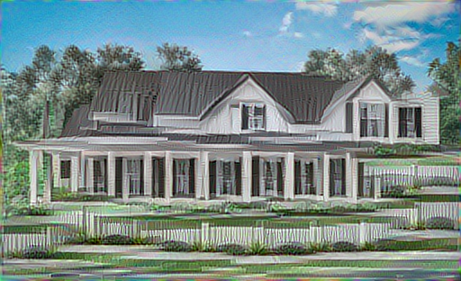

## Test 1

This test is to take a "sketch" of a house and transfer the style from an image.  The source image did not have a semantic annotation map.

### command

`doodle --style train-house.jpg --content sketch-house.jpg --output render-house.png --device=cpu --phases=4 --iterations=40`

### style

### content

### output

