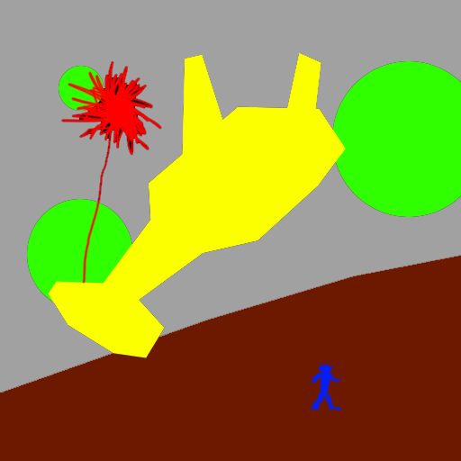
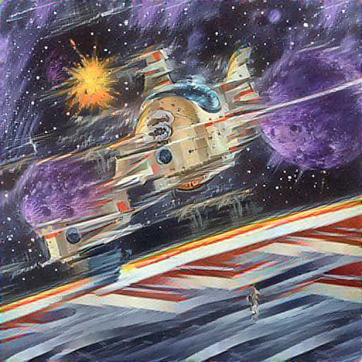

## test 2

This test took a illustrated with space scence a semantic annotation map to generate image analogies `#NeuralDoodle`

The output results provide a better understanding of "what" the semantic map does does and how it is used.

#### command

doodle --style train-space.png --output doodle-space.png --device=cpu --iterations=40`

#### style


#### content



#### output



##### standard out

```
Neural Doodle for semantic style transfer.
  - Using device `cpu` for processing the images.
  - Adding `doodle-space_sem.png` as semantic map.
  - Loading `train-space.png` for style data.
  - Adding `train-space_sem.png` as semantic map.

Phase #0: resolution 128x128  scale 0.25
  - Style layer 3_1: (900, 260, 3, 3) patches in 2,106kb.
  - Style layer 4_1: (196, 516, 3, 3) patches in 910kb.

  0   loss 6.24e+03   style 3_1 9.65e+02  4_1 5.06e+03   quality  4.7%   time 5.3s
 10   loss 2.94e+03   style 3_1 5.74e+02  4_1 2.23e+03   quality 41.0%   time 49.3s
 20   loss 2.49e+03   style 3_1 4.72e+02  4_1 1.94e+03   quality 62.1%   time 49.5s
 30   loss 2.30e+03   style 3_1 4.15e+02  4_1 1.84e+03   quality 73.9%   time 50.7s

Phase #1: resolution 256x256  scale 0.5
  - Style layer 3_1: (3844, 260, 3, 3) patches in 8,994kb.
  - Style layer 4_1: (900, 516, 3, 3) patches in 4,179kb.

 40   loss 3.54e+03   style 3_1 7.15e+02  4_1 2.82e+03   quality  4.9%   time 21.0s
 50   loss 1.68e+03   style 3_1 4.15e+02  4_1 1.26e+03   quality 42.3%   time 213.4s
 60   loss 1.48e+03   style 3_1 3.50e+02  4_1 1.12e+03   quality 64.1%   time 207.7s
 70   loss 1.40e+03   style 3_1 3.18e+02  4_1 1.07e+03   quality 76.6%   time 207.1s

Phase #2: resolution 512x512  scale 1.0
  - Style layer 3_1: (15876, 260, 3, 3) patches in 37,149kb.
  - Style layer 4_1: (3844, 516, 3, 3) patches in 17,851kb.

 80   loss 2.89e+03   style 3_1 6.37e+02  4_1 2.25e+03   quality  5.0%   time 93.3s
 90   loss 1.28e+03   style 3_1 3.61e+02  4_1 9.13e+02   quality 43.5%   time 919.0s
100   loss 1.11e+03   style 3_1 3.10e+02  4_1 7.92e+02   quality 66.0%   time 894.3s
110   loss 1.05e+03   style 3_1 2.88e+02  4_1 7.55e+02   quality 78.7%   time 906.8s

Optimization finished in 4898.3s, average pixel error 5.5!
```

