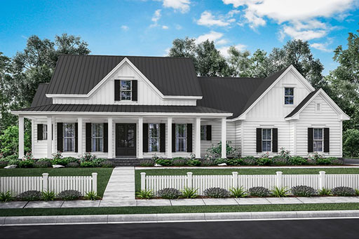
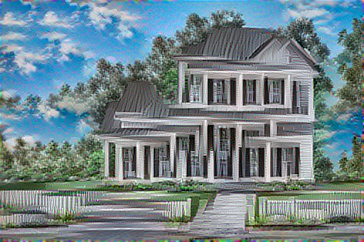

## test 4

This test took a picture of a house with semantic annotation map to generate image analogies from a simple kids style doodle.

The semantic annotation maps were made from images masks using Photoshop.

#### command

`doodle --style train-house.jpg --output house-doodle.png --device=cpu --iterations=40`

#### style

#### content

#### output

