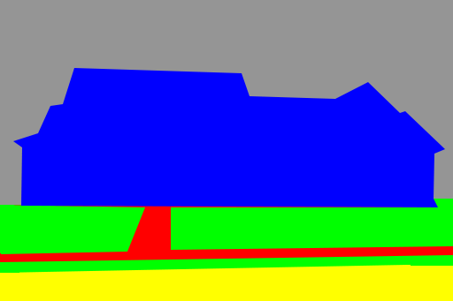
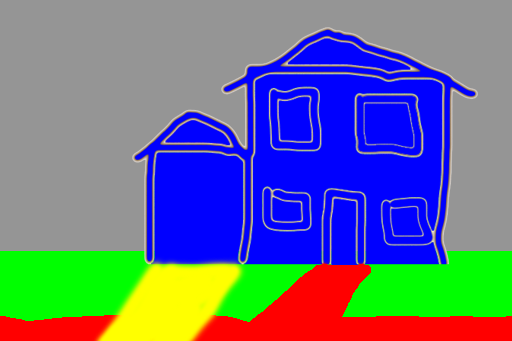
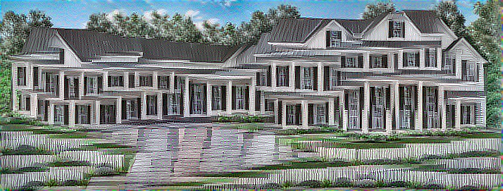

## Test 4

This test took a picture of a house with semantic annotation map to generate image analogies from a simple kids style doodle.

The semantic annotation maps were made from images masks using Photoshop.

### command

`doodle --style train-house.jpg --output house-doodle.png --device=cpu --iterations=40`

### style

### content

### output

## Test 4 => 1

### source

### content

### output

