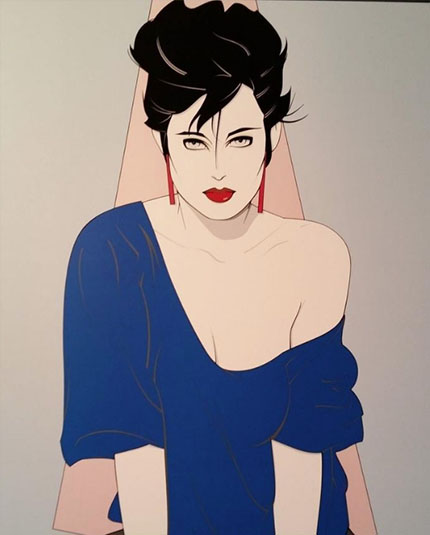
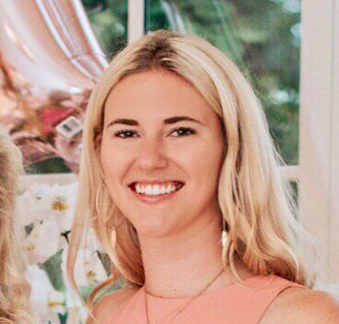
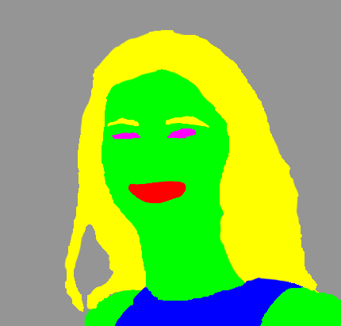
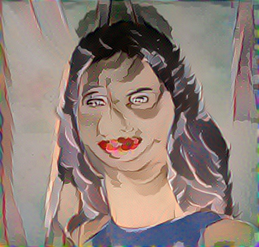

## test 5

This test took a picture of a Ali with semantic annotation map toperform regular style transfer that will synthesize a portrait of her like a Nagel.

The semantic annotation maps were made from images masks using Photoshop.

#### command

`doodle --style style-nagel.jpg --content content-ali.jpg --output render-Ali-Nagel.png --device=cpu --phases=4 --iterations=40`

#### style

#### content

#### output

----

`doodle --style style-nagel.jpg --content content-ali.jpg --output render-Ali-Nagel.1.png --device=cpu --phases=4 --seed-range=8:120 --style-weight=50.0 --iterations=40`
